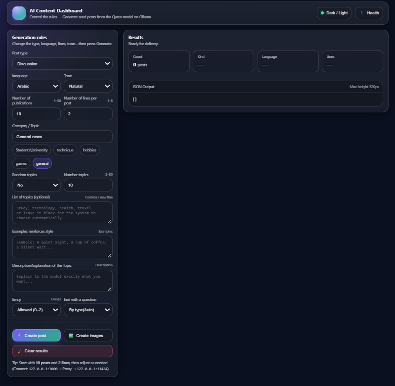
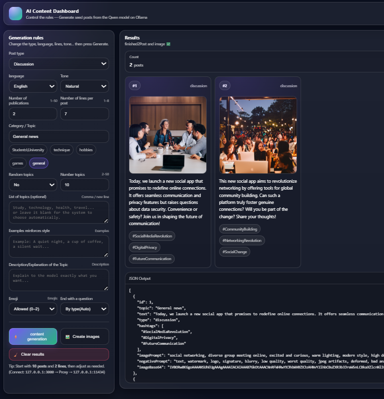

# 🚀 Autonomous Local AI Content Engine & Dashboard

 



An enterprise-grade, full-stack orchestration pipeline that bridges local Large Language Models (**Ollama/Qwen2.5**) and advanced Diffusion Models (**Stable Diffusion/A1111**). This repository hosts a professional production line engineered to generate, critique, filter, and illustrate high-engagement social media posts with native multi-lingual support (Arabic, English, and Mixed).

---

## 🔥 Key Technical Highlights

* **3-Stage Text Orchestration Pipeline**: Implements an advanced architectural pattern:
  `Strategic Plan` ➔ `Contextual Drafting` ➔ `Automated Critique & Refinement`
  This totally eliminates generic AI clichés and enhances semantic coherence.
* **VRAM-Safe Queue Execution**: Designed specifically for consumer-grade GPUs, the image subsystem processes Stable Diffusion requests sequentially to protect memory blocks and mitigate Out-Of-Memory (OOM) errors.
* **Deterministic Structured JSON Output**: Hard-enforced JSON schemas via native local model parameters (`format: "json"`), paired with a deep regex fallback parser (`safeJsonParseMaybe`) for bulletproof runtime resilience.
* **Smart Prompt Expansion Core**: Automatically synthesizes metadata and emotional context from generated posts to construct deterministic, token-optimized visual prompts: `(Subject + Scene + Mood + Lighting + Style)` for SD Samplers.
* **Heuristic Quality Scoring**: Built-in algorithmic auditing (`scoreWeakText`) that dynamically flags, filters, or drops generic, repetitive, or low-quality content before payload delivery.

---

## 🛠️ System Architecture

The ecosystem splits the heavy lifting between an asynchronous multi-pass Express backend gateway and an ultra-responsive, semantic web dashboard:

```text
       [ User UI Controls ] 
                │
                ▼
┌─────────────────────────────────────────┐
│ Stage 1: Asymmetric Planning Pass       │ ──► Model Options Adjusted Per Post Type
└─────────────────────────────────────────┘
                │
                ▼
┌─────────────────────────────────────────┐
│ Stage 2: Drafting Production Matrix     │ ──► Enforces Dynamic Structural Rules
└─────────────────────────────────────────┘
                │
                ▼
┌─────────────────────────────────────────┐
│ Stage 3: Reflection & Critique Loop     │ ──► Selective Filtering via Weak Text Scoring
└─────────────────────────────────────────┘
                │
                ▼
┌─────────────────────────────────────────┐
│ Stage 4: Sequential SD Prompt Building  │ ──► Generates Base64 safe-buffered assets
└─────────────────────────────────────────┘
                │
                ▼
      [ Polished Output UI ]
```

---

## ⚡ Prerequisites & Local Environment Setup

Ensure you have your environment running locally with API paths exposed:

### 1. Ollama Infrastructure
Install Ollama and fetch the optimized instruction-tuned Qwen model:

```bash
ollama pull qwen2.5:7b-instruct
```
*The endpoint will be exposed natively at `http://127.0.0.1:11434`.*

### 2. Stable Diffusion WebUI (A1111)
Launch your local webui cluster with the necessary API capabilities enabled:

**Windows:**
```bat
webui-user.bat --api
```

**Linux / macOS:**
```bash
./webui-user.sh --api
```
*The endpoint will be exposed natively at `http://127.0.0.1:7860`.*

---

## 📦 Installation & Initialization

1. **Clone the repository:**
   ```bash
   git clone https://github.com/A-rahhal/local-ai-content-dashboard.git
   cd local-ai-content-dashboard
   ```

2. **Deploy Node dependencies:**
   ```bash
   npm install
   ```

3. **Ignite the Gateway Service:**
   ```bash
   npm start
   ```

   *The application router lives at `http://127.0.0.1:3000`.*

---

## 🔌 API Gateway Interface

### 🟢 `GET /health`
Performs concurrent ping tests across Ollama core clusters and Stable Diffusion matrices, auditing network integrity, connection states, and counting active model parameters.

### 🔵 `POST /generate-posts`
Produces optimized raw textual copy with multi-lingual sanitization filters.

**Sample Payload:**
```json
{
  "count": 10,
  "lines": 2,
  "category": "Artificial Intelligence",
  "postKind": "discussion",
  "lang": "mix",
  "tone": "friendly"
}
```

### 🔵 `POST /generate-posts-with-images`
Executes the full 4-stage pipeline. Text components are optimized, evaluated, and channeled sequentially into the image diffusion matrix to return fully illustrated social media cards containing local inline Base64 data strings.

---

## 📁 Directory Structure

```plaintext
├── public/                 # Client UI Static Assets
│   ├── index.html          # Semantic HTML5 Control Panel
│   ├── style.css           # Modern Dashboard CSS Architecture
│   └── script.js           # Client-side API State Controller
├── server.js               # Node.js Express Gateway Core Architecture
├── package.json            # Dependency & Build Management Matrix
└── README.md               # Production Documentation
```

---

## 🛡️ License

Distributed under the MIT License. See `LICENSE` for more information.
